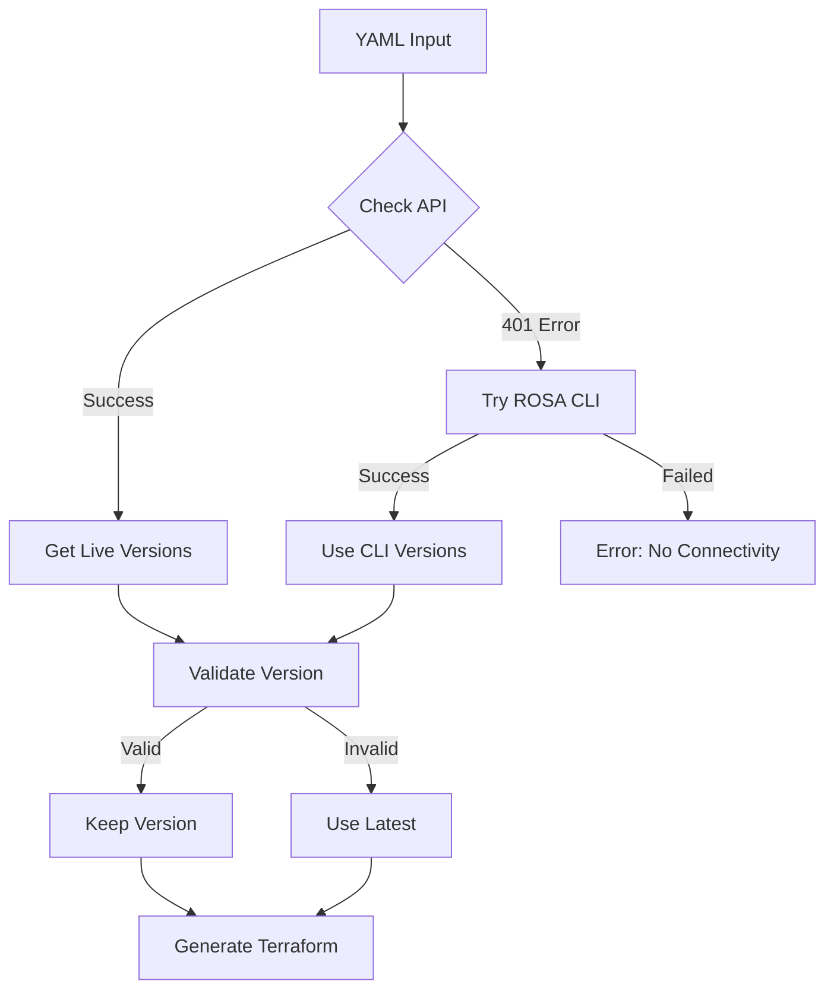

# Dynamic ROSA Version Management

YamlForge **automatically fetches supported OpenShift versions** from the Red Hat API and validates/fixes configurations to ensure successful ROSA deployments.

##  Features

### ** Dynamic Version Fetching**
- **Fetches live supported versions** from Red Hat OpenShift Cluster Manager API
- **ROSA CLI integration** as backup method for version discovery
- **Caching** to avoid repeated API calls (1-hour cache)
- **Always current** - no outdated static version lists

### ** Intelligent Version Selection**
- **Strict validation by default** - Fails on unsupported versions to prevent surprises
- **Optional auto-discovery** - Can auto-discover and upgrade unsupported versions if explicitly enabled
- **Preserves valid versions** when they're already supported  
- **Detailed error messages** - Shows available versions when validation fails
- **Keyword support** - Accepts `latest` and `stable` as version aliases

### ** Multi-Method Support**
1. **Red Hat API** (primary) - Live data from `api.openshift.com`
2. **ROSA CLI** (secondary) - Uses local `rosa` command if available
3. **Requires connectivity** - Ensures always-current version data

---

##  **Version Control Options**

### **Default Behavior (Strict Validation)**
```yaml
openshift:
  clusters:
    - name: my-cluster
      version: "1.0.0"  #  FAILS with detailed error message
      # ... other config
```

### **Auto-Discover and Upgrade Unsupported Versions**  
```yaml
yamlforge:
  # Set in defaults/openshift.yaml or override in main config
  openshift:
    auto_discover_version: true        #  Enable auto-discovery globally
    
    clusters:
      - name: my-cluster
        version: "1.0.0"                  #  Unsupported version → will auto-discover and upgrade
        # ... other config
```

### **Recommended Patterns**
```yaml
yamlforge:
  # Global setting - applies to all clusters
  openshift:
    auto_discover_version: false       #  Strict validation (recommended for production)
# auto_discover_version: true     #  Flexible auto-discovery (for dev environments)
    
    clusters:
      #  Explicit supported version
      - name: production-cluster
        version: "4.18.19"

      #  Always get latest
      - name: dev-cluster
        version: "latest"
        
      #  Version may become unsupported over time
      - name: test-cluster 
        version: "4.16.0"                 # Behavior depends on global auto_discover_version setting
```

---

##  YamlForge Integration

### **Built-in Dynamic Version Management**
- **Automatic version validation** during Terraform generation
- **Seamless integration** with ROSA provider
- **Zero configuration** - works out of the box
- **Live version fetching** from Red Hat API
- **ROSA CLI fallback** for version discovery

---

##  Requirements

### **Environment Variables**
```bash
# Required for API access
export REDHAT_OPENSHIFT_TOKEN="your_offline_token"
export REDHAT_OPENSHIFT_URL="https://api.openshift.com"
```

### **Dependencies**
```bash
# Install Python requirements
pip install requests>=2.25.0

# Already included in requirements.txt
```

### **Authentication Setup**
```bash
# Get token manually from: https://console.redhat.com/openshift/token
export REDHAT_OPENSHIFT_TOKEN="your_offline_token_here"
export REDHAT_OPENSHIFT_URL="https://api.openshift.com"
```

---

##  How It Works

### **1. API Query Process**


### **2. Version Validation Logic**
```python
def get_recommended_version(input_version=None):
    """
    1. If input_version is supported → use it
    2. If input_version is invalid → use latest  
    3. If no input_version → use latest
    """
```

### **3. Version Discovery Strategy**
1. **Primary**: Red Hat API (`api.openshift.com/api/clusters_mgmt/v1/versions`)
2. **Secondary**: ROSA CLI (`rosa list versions --output json`)
3. **Requires connectivity**: Fails gracefully if no live data available

---

##  Usage Examples

### **Example 1: Fix Outdated Configuration**
```yaml
# Before (my-config.yaml)
openshift_clusters:
  - name: "prod-cluster" 
    version: "4.14.15"  #  Outdated

# YamlForge automatically detects and validates versions
yamlforge my-config.yaml -d terraform/

# After (YamlForge updates to latest supported)
openshift_clusters:
  - name: "prod-cluster"
    version: "4.19.3"   #  Latest supported
```

### **Example 2: Version Validation**
```bash
# YamlForge automatically validates versions during processing
yamlforge my-config.yaml -d terraform/

# If version is supported: proceeds normally
# If version is unsupported: shows error with available versions
# Error: OpenShift version '4.14.15' is not supported.
# Supported versions include: 4.18.19, 4.19.3, 4.19.2, 4.18.9, 4.18.8
# Latest version: 4.18.19. Use 'latest' or specify a supported version.
```

### **Example 3: Strict Validation (Default)**
```bash
# This FAILS by default for unsupported versions
yamlforge my-config.yaml -d terraform/

# Error: OpenShift version '4.14.15' is not supported.
# Supported versions include: 4.18.19, 4.19.3, 4.19.2, 4.18.9, 4.18.8
# Latest version: 4.18.19. Use 'latest' or specify a supported version.
```

### **Example 4: Auto-Discovery Mode**
```yaml
# my-config.yaml with auto-discovery enabled globally
yamlforge:
  openshift:
    auto_discover_version: true     # Enable auto-discovery for all clusters
    
    clusters:
      - name: "prod-cluster"
        version: "4.14.15"             # Unsupported → will auto-discover and upgrade
```

```bash
# This succeeds with warning
yamlforge my-config.yaml -d terraform/
# Warning: Version 4.14.15 not supported, using 4.18.19
#  Terraform configuration generated successfully
```

---

##  Error Handling

### **API Authentication Issues**
```bash
# Error: Bearer token can't be verified
# Solution: Refresh token
export REDHAT_OPENSHIFT_TOKEN="your_offline_token_here"
```

### **Network Issues**
```bash
# Clear error message with guidance
# Error: "Cannot retrieve supported ROSA versions from API"
# "Please check your REDHAT_OPENSHIFT_TOKEN and network connectivity"
```

### **Missing Dependencies**
```bash
# Install requirements
pip install -r requirements.txt
```

---

##  Benefits

### **Always Current**
- **No manual updates** needed for version lists
- **Automatically detects** OpenShift releases
- **Prevents deployment failures** from outdated versions

### **Robust Architecture**
- **Multiple discovery methods** ensure reliability
- **Clear error handling** when connectivity unavailable
- **Always up-to-date** version information

### **Developer Friendly**
- **Clear warnings** when versions are updated
- **JSON output** for scripting and automation
- **Dry-run mode** to preview changes

### **Enterprise Ready**
- **Token-based authentication** with Red Hat services
- **Live version validation** prevents deployment failures
- **Integrates with** Ansible vault workflows

---

##  Supported Versions

**Latest supported versions (live from Red Hat API):**
- Latest series: `4.19.x` releases
- Stable series: `4.18.x` releases  
- LTS series: `4.17.x`, `4.16.x`, `4.15.x` releases
- Earlier series: `4.14.x`, `4.13.x` releases

**Dynamic support:** All versions currently supported by Red Hat for ROSA deployments

---

##  Workflow Integration

YamlForge automatically handles version management:

1. **YAML configurations** work seamlessly
2. **Invalid versions** are automatically fixed with warnings
3. **Valid versions** are preserved as-is
4. **Transparent operation** - only intervenes when necessary to prevent deployment failures

The dynamic version management operates in the background and ensures all ROSA deployments use supported OpenShift versions. 
