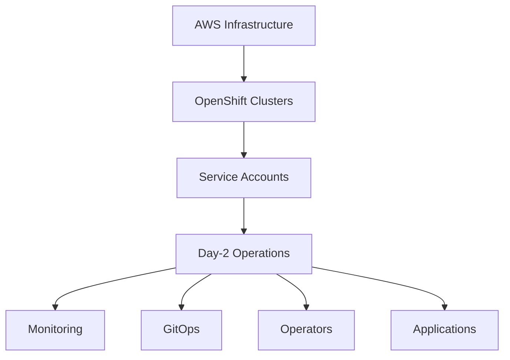

# 🚀 OpenShift Terraform Deployment Guide

This guide covers the complete deployment workflow for OpenShift clusters using YamlForge-generated Terraform configurations.

## 📋 Deployment Overview

YamlForge uses a **two-phase deployment approach** for safer and more reliable OpenShift deployments:

1. **Phase 1**: Core Infrastructure (AWS + OpenShift Clusters)
2. **Phase 2**: Day-2 Operations (Monitoring, GitOps, Operators)

## 🎯 Phase 1 - Core Infrastructure Deployment

Deploy the essential infrastructure including AWS resources and OpenShift clusters:

```bash
cd /path/to/generated/terraform
terraform init
terraform plan
terraform apply -auto-approve
```

**What gets deployed:**
- ✅ AWS VPCs, subnets, security groups
- ✅ ROSA/ARO clusters (control plane + worker nodes)
- ✅ Basic networking and connectivity
- ✅ Service accounts and RBAC
- ❌ **NO** Day-2 operations (monitoring, GitOps, operators)

**Expected wait time:** 10-15 minutes for clusters to become ready

## ⏳ Wait for Cluster Readiness

Monitor cluster status before proceeding to Day-2 operations:

```bash
# Check ROSA cluster status
rosa describe cluster <cluster-name>

# Check cluster API availability
oc cluster-info

# Verify all nodes are ready
oc get nodes
```

**Cluster is ready when:**
- ✅ All nodes show `Ready` status
- ✅ Cluster API is accessible
- ✅ System pods are running

## 🎯 Phase 2 - Day-2 Operations Deployment

Once clusters are ready, deploy monitoring, GitOps, and operators:

```bash
terraform plan -var='deploy_day2_operations=true'
terraform apply -var='deploy_day2_operations=true' -auto-approve
```

**What gets deployed:**
- ✅ Cluster monitoring (Prometheus, Grafana)
- ✅ OpenShift GitOps (ArgoCD)
- ✅ OpenShift operators (as configured)
- ✅ Application deployments
- ✅ Custom resources and configurations

## 💡 Deployment Options

### Option 1: Complete Deployment (Recommended)
```bash
# Phase 1: Core infrastructure
terraform apply -auto-approve

# Wait for clusters to be ready (10-15 minutes)

# Phase 2: Day-2 operations
terraform apply -var='deploy_day2_operations=true' -auto-approve
```

### Option 2: Core Infrastructure Only
```bash
# Deploy only core infrastructure (skip Day-2 operations)
terraform apply -var='deploy_day2_operations=false' -auto-approve

# Or simply (false is the default):
terraform apply -auto-approve
```

### Option 3: Everything in One Go (Advanced)
```bash
# Deploy everything if you're confident clusters will be ready
terraform apply -var='deploy_day2_operations=true' -auto-approve
```

## 🔧 Advanced Configuration

### Environment Variables
```bash
# Set Day-2 operations via environment variable
export TF_VAR_deploy_day2_operations=true
terraform apply -auto-approve
```

### Terraform Variables File
```hcl
# terraform.tfvars
deploy_day2_operations = true
```

### Selective Day-2 Deployment
```bash
# Target specific Day-2 resources
terraform apply -target='kubernetes_manifest.cluster_monitoring*' -auto-approve
terraform apply -target='kubernetes_manifest.openshift_gitops*' -auto-approve
```

## 🏗️ Resource Dependencies



## 🛠️ Troubleshooting

### Common Issues

#### "Failed to construct REST client"
**Cause:** Day-2 operations trying to deploy before clusters are ready  
**Solution:** Use two-phase deployment approach

```bash
# Correct approach:
terraform apply -auto-approve  # Core infrastructure only
# Wait for clusters...
terraform apply -var='deploy_day2_operations=true' -auto-approve
```

#### "Invalid AZ" Errors
**Cause:** Region mismatch in multi-region deployments  
**Solution:** Already fixed in current YamlForge version

#### "Missing required argument"
**Cause:** ROSA provider syntax issues  
**Solution:** Already fixed in current YamlForge version

### Validation Commands
```bash
# Validate configuration
terraform validate

# Check plan without applying
terraform plan -var='deploy_day2_operations=true'

# Verify cluster connectivity
oc whoami --show-server
```

## 📊 Deployment Timeline

| Phase | Duration | Resources |
|-------|----------|-----------|
| Terraform Plan | 1-2 min | All resources validated |
| Core Infrastructure | 10-15 min | AWS + OpenShift clusters |
| Cluster Ready Wait | 5-10 min | API availability |
| Day-2 Operations | 5-10 min | Monitoring, GitOps, operators |
| **Total Time** | **20-30 min** | **Complete deployment** |

## 🎯 Production Best Practices

1. **Always use two-phase deployment** for production
2. **Monitor cluster readiness** before Day-2 operations
3. **Test Day-2 operations** in development first
4. **Use version control** for terraform configurations
5. **Backup cluster state** before major changes

## 📚 Additional Resources

- [ROSA Documentation](https://docs.openshift.com/rosa/)
- [ARO Documentation](https://docs.microsoft.com/en-us/azure/openshift/)
- [OpenShift Day-2 Operations](https://docs.openshift.com/container-platform/latest/operators/understanding/operators-overview.html)
- [Terraform RHCS Provider](https://registry.terraform.io/providers/terraform-redhat/rhcs/latest/docs)

## 🚀 Quick Reference

```bash
# Standard deployment workflow
terraform apply -auto-approve                                    # Core infrastructure
terraform apply -var='deploy_day2_operations=true' -auto-approve # Day-2 operations

# Skip Day-2 operations
terraform apply -var='deploy_day2_operations=false' -auto-approve

# Check what will be deployed
terraform plan -var='deploy_day2_operations=true'
```

---

**🎉 With this approach, you'll have a robust, production-ready OpenShift deployment with zero configuration hassles!** 